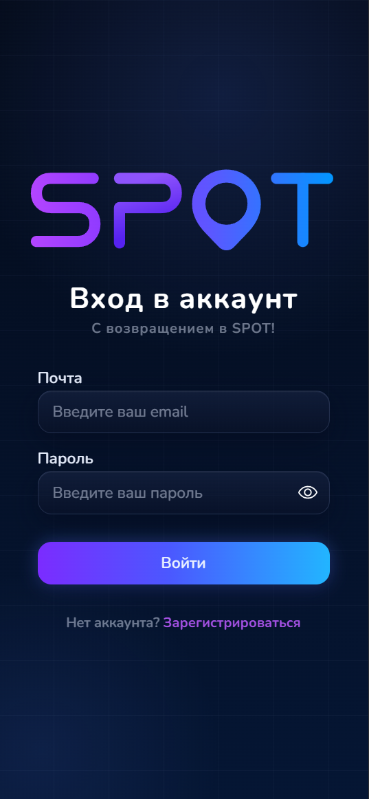
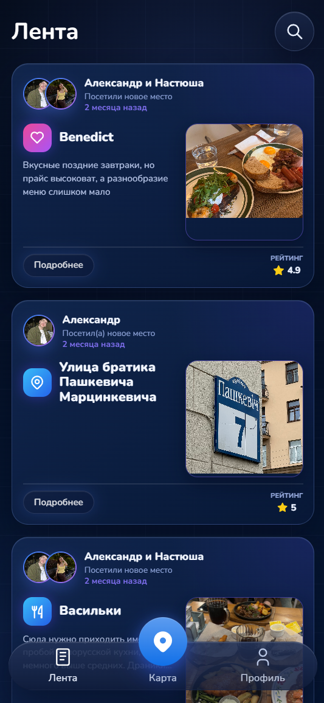
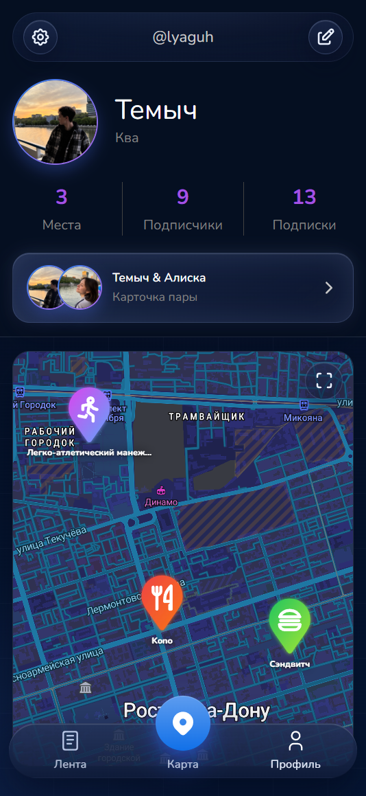
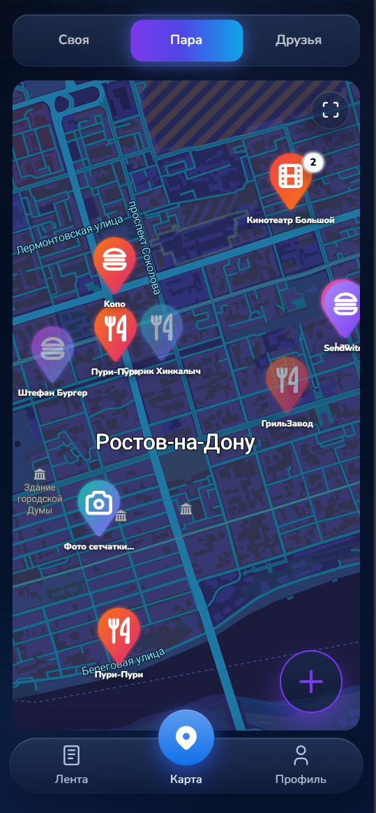
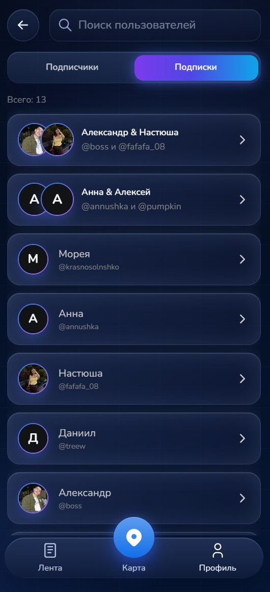
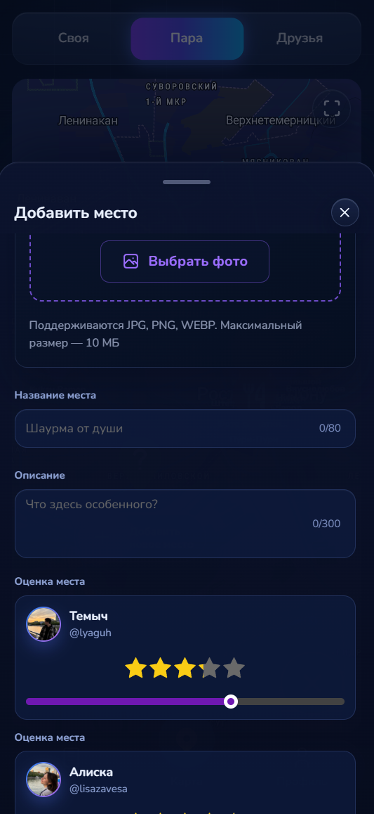

# SPOT

SPOT — это социальное веб-приложение, в котором можно сохранять любимые места на интерактивной карте и делиться ими с другими. Сохраняйте любимые места, объединяйтесь в пары для ведения общей карты и вдохновляйтесь местами, которые посещают ваши друзья. Все важные воспоминания и планы — в одном месте.

#### [Ссылка на сайт](https://spot-map.ru)

#### [Ссылка на RuStore](https://www.rustore.ru/catalog/app/site.lyaguh)

## Основные возможности

- Авторизация и регистрация пользователей
- Интерактивная карта с пользовательскими метками
- Создание, редактирование и удаление мест
- Загрузка фотографий и выставление оценок
- Статусы посещения («Посетил» / «Планирует посетить»)
- Совместная карта пары
- Подписки на пользователей и пары
- Персонализированная лента активности
- Публичные и приватные профили
- Адаптация под мобильные устройства и поддержка PWA
- Административная панель для управления системой

## Архитектура проекта

Проект состоит из клиентской и серверной частей.

### Frontend

Клиентская часть отвечает за отображение пользовательского интерфейса, взаимодействие с картой и работу с REST API.

**Стек технологий**

- React
- TypeScript
- Vite
- Redux Toolkit
- Mantine UI
- React Router
- MapLibre + react-map-gl
- PWA (Service Worker, Manifest)
- Capacitor

### Backend

Серверная часть предоставляет REST API, реализует бизнес-логику приложения, авторизацию пользователей, работу с картой, загрузку изображений и хранение данных.

**Стек технологий**

- NestJS
- Prisma ORM
- PostgreSQL
- JWT Authentication
- Docker
- Nginx

## Инфраструктура

- VPS
- Docker Compose
- Nginx
- HTTPS
- GitHub Actions
- CI/CD

# Скриншоты

 
  
  
  
  
  
  

